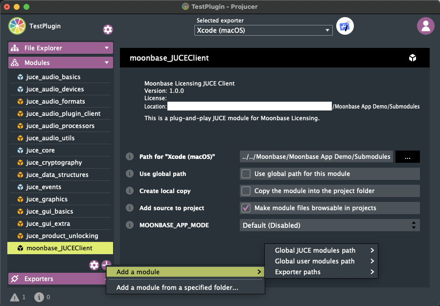
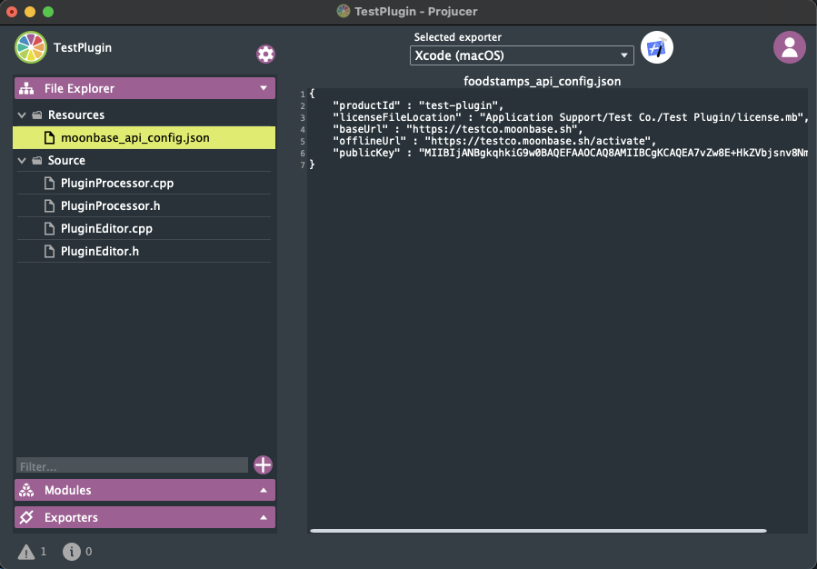
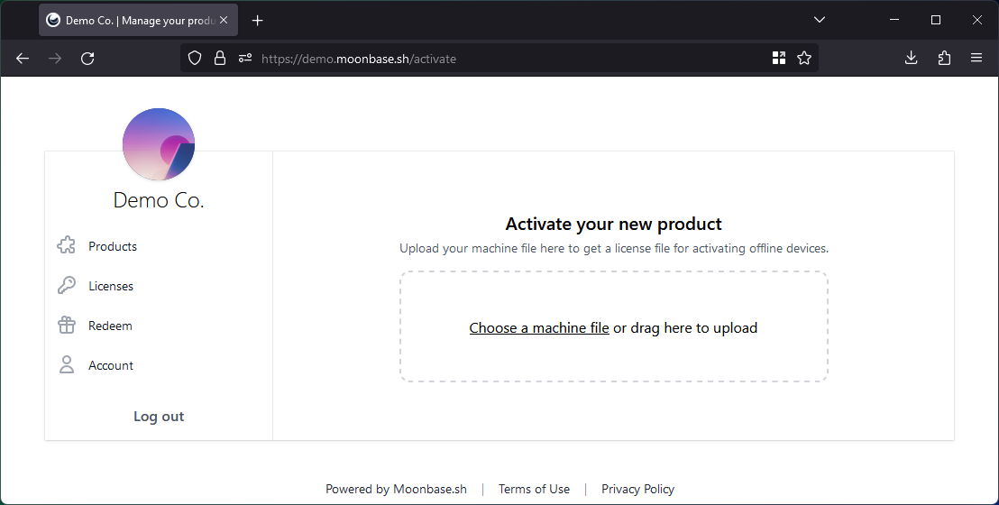
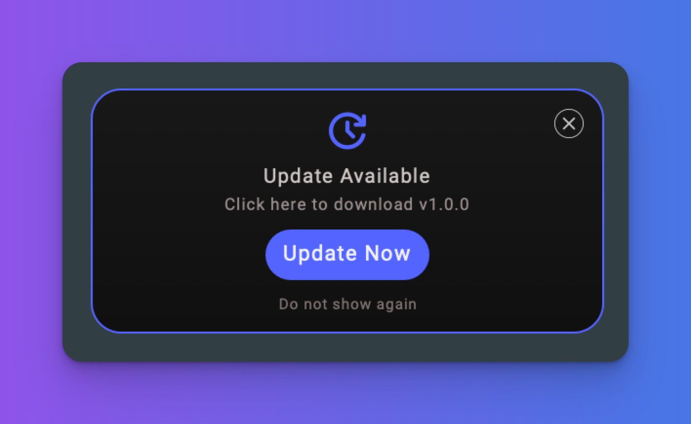

# moonbase_JUCEClient

## Introduction

`moonbase_JUCEClient` is a plug and play [JUCE module](https://github.com/juce-framework/JUCE/blob/master/docs/JUCE%20Module%20Format.md) for easy licensing integration within the [Moonbase](https://moonbase.sh) environment. 

## Requirements

JUCE 8.x or JUCE 7.0.6 or higher is required. 

This module will run on any JUCE supported platform, but has currently only been tested on macOS and Windows.

## CMake Installation

Add the submodule to your project. Assuming you keep your modules in a `modules/` folder:

```bash
$ git submodule add -b main https://github.com/Moonbase-sh/moonbase_JUCEClient modules/moonbase_JUCEClient
$ git submodule update --init --recursive
```

> [!Note]
> You'll need to keep the folder name exactly `moonbase_JUCEClient` for JUCE to consume the module properly.

#### 2. Add module to your CMake project

Add the module to your CMake project by adding the following line to your `CMakeLists.txt` file,  *before* the call to `juce_add_plugin` (but after JUCE is added).

```cmake
# use the same directory you used in the git submodule command above
add_subdirectory (modules/moonbase_JUCEClient) 
```

*After* your `juce_add_plugin` call, link the module to your plugin, for example:

```
target_link_libraries("YourProject" PRIVATE moonbase_JUCEClient)
```

#### 3. Add `moonbase_api_config.json` to your CMake project

Go to the [Moonbase admin](https://app.moonbase.sh/products/), select your product, scroll down to `Licensing` and click `Actions > Implementation Guide > JUCE > Download` to download your`moonbase_api_config.json` file.

If you already have a BinaryData target, add the file to wherever you store your assets and add the filename to `SOURCES`.

If you want to set up a new BinaryData target, add the following to your `CMakeLists.txt` file:

```cmake
juce_add_binary_data(mock_binary SOURCES assets/moonbase_api_config.json)
```

## Projucer Installation

#### 1. Clone module into your preferred module location

Assuming you keep your modules in a `modules/` folder:

```bash
$ git submodule add -b main https://github.com/Moonbase-sh/moonbase_JUCEClient modules/moonbase_JUCEClient
$ git submodule update --init --recursive
```

If you prefer to keep your modules separate from projects, just clone (or download)

```bash
$ git clone https://github.com/Moonbase-sh/moonbase_JUCEClient --recurse-submodules
```

#### 2. Add module to your Projucer project

Open your .jucer project file and add the module to your project by clicking on the "Add module" button and selecting the `moonbase_JUCEClient` folder.




#### 3. Add `moonbase_api_config.json` to your project

Go to the [Moonbase admin](https://app.moonbase.sh/products/), select your product, scroll down to `Licensing` and click `Actions > Implementation Guide > JUCE > Download` to download your`moonbase_api_config.json` file.

Make sure it's compiled as a `Binary Resource` (this is the default setting; you can check by clicking on the containing directory in Projucer). 



##### 4a. Switch to App Mode (optional, not needed for Audio Plugin projects)

App Mode is a purely cosmetic feature. When enabled, the activation button in the default moonbase UI  will display "Activate *App-Name*" instead of a more generic "Activate your plugin", which is used by default for plugin projects. If you want to display your plugin's name in the activation button you can also enable App Mode for your plugin project.

## Example Projects 

We provide example projects and detailed integration readmes under the following links:

[Project Example and Readme: JUCE Plugins](https://github.com/Moonbase-sh/Moonbase-JUCE-Plugin-Demo)

[Project Example and Readme: JUCE Apps](https://github.com/Moonbase-sh/Moonbase-JUCE-App-Demo)

## Quick Start

## Add `moonbaseClient` to PluginProcessor.h

You'll want this to be a public member. 

It's easiest to use the macro, as it adds some extra stuff: 

```cpp
MOONBASE_DECLARE_LICENSING_USING_JUCE_PROJECTINFO
```

When using CMake (which defaults to not making `ProjectInfo` available), you can use this alternative macro, passing your company name, the `productID` from the moonbase json and a VERSION variable:

```cpp
MOONBASE_DECLARE_LICENSING ("MyCompany", "my-moonbase-product-id", VERSION)
```

## Add the `activationUI` member to PluginEditor.h

Add this as a private member:

```cpp
    std::unique_ptr<Moonbase::JUCEClient::ActivationUI> activationUI { myPluginProcessor.moonbaseClient->createActivationUi(*this)
```

Or via a macro:

```cpp
MOONBASE_DECLARE_AND_INIT_ACTIVATION_UI (myPluginProcessor);
```

> [!TIP] Be sure to place the `MOONBASE_DECLARE_LICENSING` macro *after* you declare `myPluginProcessor` (or whatever yours is called), otherwise it may compile but EXC_BAD_ACCESS at runtime.

If you are using Web UI, you can add the following members afterwards, see the plugin example implementation for more details](https://github.com/Moonbase-sh/Moonbase-JUCE-Plugin-Demo/blob/main/Source/PluginEditor.h#L15-L31):

```cpp
Moonbase::JUCEClient::WebBrowserOptions browserOptions;
WebBrowserComponent webBrowser;
```

## Edit PluginEditor.cpp

In your PluginEditor.cpp `resized` implementation, add `MOONBASE_RESIZE_ACTIVATION_UI`. 

And in your PluginEditor.cpp constructor, you can customize the activation text and logo:

```cpp
if (activationUI)
{
    // There are a max of 2 lines of text on the welcome screen, define them here
    activationUI->setWelcomePageText ("Weightless", "License Management");

    // Set the logo inside the spinner (when waiting for web responses)
    activationUI->setSpinnerLogo (Drawable::createFromImageData (BinaryData::MoonbaseLogo_svg, 
                                                                BinaryData::MoonbaseLogo_svgSize));

    // Scale the spinner logo as required for your asset if needed. See Submodules/moonbase_JUCEClient/Assets/Source/SVG/OverlayAssets for ideal assets.
    // activationUI->setSpinnerLogoScale (0.5f);
    
    // Set the company logo, this is the logo that is displayed on the welcome screen and the activated info screen
    activationUI->setCompanyLogo (std::make_unique<CompanyLogo> ());
}
```

## API 

You can access the licensing API directly from the `moonbaseClient` member held by your processor. 

For example, to check if the user is on a trial, use `moonbaseClient->isTrial()`. To see when the trial expires, `moonbaseClient->getLicenseExpiration()`.

See JUCEClientAPI.h for the full list.

## Implementation Details 

### `moonbase_api_config.json`

This contains the basic config for the moonbase product, including the public key and endpoints.

### License File

The module uses a license file called `license.mb` to store the user's license information. The license file contains metadata about user and their activation status, as well as the public key, in a base64 encoded format. 

This file is stored in the user's application data directory. The path is adjustable in the configuration file generated by Moonbase, and is platform dependent, for example in `~/Library/YourCompany` on macOS. For more information [see the JUCE docs for `userApplicationDataDirectory`](https://docs.juce.com/master/classFile.html#a3e19cafabb03c5838160263a6e76313da0c9f89d8dc9f9f32c9eb42428385351d)

> [!NOTE]
> This JUCE module uses a custom version of the moonbase versionsing API, [not the JWT API described in the docs](https://moonbase.sh/docs/licensing/api/#licensing).

#### Online License Validation

When an instance of the plugin is started, the API automatically checks the activation status of a user's license.

The `Moonbase::JUCEClient::OnlineValidator` class starts online validation at a random time of max 3 seconds after plugin start, so if you load many instances at the same time, they won't all *phone home* at the same time. 

Each process checks the last validation time to see if it's been less than 1m since the last validation, in which case it will not try to validate again.

### Obfuscation

[Obfy](https://github.com/fritzone/obfy) is included for binary obfuscation. All activation and license methods are wrapped by obfy macros. We highly recommend reading Obfy's README. 

### Key Integrity Check

While the core license validation process is obfuscated, the public key material is by default not. In the past, we've seen attacks on this module where crackers would replace the public key in the binary and generate their own license tokens. To make sure the key is the correct key at runtime, you can optionally enable a key integrity check. This check is generated at build time, adding obfuscated checks to the license validation process, asserting random parts of the key. The performance impact of this check is negligible during normal use.

To add this check to your project, add the following step to your build script:

```sh
"moonbase_JUCEClient/KeyIntegrity/IntegrityCheck.sh" "moonbase_api_config.json"
```

If your API configuration is elsewhere, update the path. For a full example build script using this check, see https://github.com/Moonbase-sh/Moonbase-JUCE-App-Demo/blob/main/Scripts/Build.sh.

### Activation

The module offers various functions to activate and deactivate your product. The included `ActivationUI` component implements the `Auto Activation`, `Deactivation`and `Offline Activation` methods. 

If you provide your own UI solution, you can use `Online Activation` , which utilizes a more classic username/password flow.

#### *`- Auto Activation`*

This is the easiest and method for the end-user of your product.

The user simply clicks an activation button, which opens up the Moonbase platform in a browser window. The user finishes their activation in the browser window, while the Client library polls for a result. Once the activation is complete in the browser, the product will be activated. 

By default, Auto Activation occurs automatically when a license file isn't present or valid. However, you can also manually request it:

On your `moonbaseClient` API object, call 

```cpp
void Moonbase::JUCEClient::API::requestAutoActivation (const AutoActivationRequestCallback& callback)
```
The callback you provide, will contain a `pollUrl` and a `browserUrl`. 
1. Open the `browserUrl` in a browser window. 
2. Now you can either poll the `pollUrl` yourself to check for the browser activation result, or use the provided 
```cpp
void Moonbase::JUCEClient::API::startPollingAutoActivationResult (const AutoActivationPollCallback& callback)
```
function to poll the activation status, which will be continuously reported to you on your provided callback.

#### *- Online Activation*

Alternatively to the Auto Activation flow, you can also implement a more traditional username/password flow for your users. This method requires you to provide your own UI for the user to enter their credentials.

To start the online activation process, call 

```cpp 
void Moonbase::JUCEClient::API::requestOnlineActivation (const String& email, const String& password)
```
To monitor the activation state,  use the `ActivationStateChangedCallback` as described above.

#### *- Offline Activation*

To support offline environments, you can provide an offline license file to your users. This file is generated by the Moonbase platform and manually imported by the user into your product. 

To support offline activation, first turn it on in your [moonbase product admin](https://app.moonbase.sh/products).

Generate the machine file via the moonbaseClient:

```cpp
void Moonbase::JUCEClient::generateMachineFile (const MachineFileCallback& callback)
```

The generated machine file can be uploaded to Moonbase, either via storefront SDKs or through the hosted UI that comes with your Moonbase account.



After uploading the machine file, the user can then download the offline license file, which can be imported via 
```cpp
bool Moonbase::JUCEClient::loadOfflineLicenseFile (const File& file)
```

> [!TIP]
> This returns only `true` if both import and validation worked correctly.

If you don't want to support offline activations, you can disable the flow by passing in an empty string to the offlineUrl parameter of your `moonbase_api_config.json`:

```json
{
    "offlineUrl" : "",
    ...
}
```

#### *`- Activation State Callbacks`* 

To monitor the activation state of your product, you can provide a callback function to your API object. This callback will be called whenever the activation state of your product changes. To do so simply call 

```cpp
void Moonbase::JUCEClient::addActivationStateChangedCallback (const ActivationStateChangedCallback& callback)
```    

#### *`- Deactivation`* 

To manually deactivate the product, call 
```cpp
void Moonbase::JUCEClient::requestDeactivation (const DeactivationCallback& callback)
```

The callback will return a `bool` indicating if the deactivation was successful. If it was successful the local license file will be deleted and the `ActivationStateChangedCallback` will be called accordingly. 

### Unique Device ID

The module uses a unique device ID to identify a machine. This ID is generated by the JUCE library via [juce::SystemStats::getUniqueDeviceID](https://docs.juce.com/master/classSystemStats.html#a61b9c7da7df045b488f6b222c52f32a4), which has some extra caveats on iOS. [See the JUCE docs for more information.](https://docs.juce.com/master/classSystemStats.html#a61b9c7da7df045b488f6b222c52f32a4)  
The result of this function is hashed (SHA256) together with a platform prefix and a salt to generate a unique device ID, which is then converted to a Hex string.

### Online Grace Period

If the online validation fails for reasons like no available internet connection (http response codes 401 - 600) the plugin will enter a grace period. The grace period is 14 days by default, but can be configured by calling `Moonbase::JUCEClient::setOnlineVerificationGracePeriodDays`. During the grace period, the plugin will still work as usual, while trying to validate each time it starts up. If the grace period expires, the product will be deactivated and the user has to activate again.

### Advanced analytics

By default, this JUCE module will report the project version and platform to the Moonbase backend for use in analytics. If you wish to include more details, you may enable an extended set of metrics, or supply your own.

To use the extended set, which includes metrics like JUCE version used, CPU details, plugin host and more, enable the flag:

```cpp
// First flag is for whether or not to transmit analytics at all
// Second flag is for whether or not to include the extended set of default metrics
moonbaseClient->setTransmitAnalytics (true, true); 
```

The extended metrics are disabled by default, and you may need to get user consent to gather telemtry before enabling this, either through a EULA agreement or explicit opt-in in your plugin.

In the case you want to add any custom dimensions to the analytics, you may use the callback registration function, a full example of this can be found in our app demo: https://github.com/Moonbase-sh/Moonbase-JUCE-App-Demo/blob/main/Source/MainComponent.cpp#L98-L117

### Update badge

In case you are using Moonbase to also host releases, information about the currently released version is embedded in license tokens, and exposed in the APIs of this module.
The module also has an optional update badge that can be enabled, which opens a browser going either to the hosted customer portal, or your own website using the Embedded Storefront based on your Moonbase account settings.



If using the built-in activation UI, this badge can be enabled to automatically display when updates are available by calling the following:

```cpp
activationUI->enableUpdateBadge ();
```

For a full example, check out the [JUCE App Demo example](https://github.com/Moonbase-sh/Moonbase-JUCE-App-Demo/blob/main/Source/MainComponent.cpp#L86).

In case you've built custom UIs instead, you can easily add the badge to your own parent component by using the `createUpdateBadgeComponent (juce::Component& parent, const UpdateBadge::Options& options)` method on the client API.

## Troubleshooting and FAQ

### Can I run a JUCE version earlier than 7.0.6?

No. We use `juce::SystemStats::getUniqueDeviceID ()` to generate a unique device ID. It was overhauled in JUCE 7.0.6 to provide more reliable results.

### Do I have to use the macros?

No. Most of the macros are one-liners except for `MOONBASE_DECLARE_LICENSING` which is probably more convenient to use as a macro.

### Why is my activation UI not showing up?

Be sure you added `MOONBASE_RESIZE_ACTIVATION_UI` in your PluginEditor's `resized`. 

## What's up with all the Impl stuff?

Originally the module was going to be compiled into a blackbox static library. That didn't end up being the direction on release, but the impl was kept to give that option in the future. 
